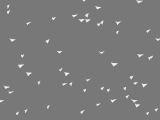
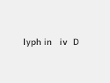
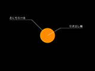
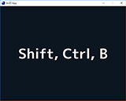
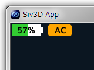

 

※ **以下のサイトへ移行予定です。** 
[Siv3Dミニサンプル集](https://scrapbox.io/voidproc-siv3d-examples/Siv3D%E3%83%9F%E3%83%8B%E3%82%B5%E3%83%B3%E3%83%97%E3%83%AB%E9%9B%86)

 
 

# Siv3D Examples

ここでは、[Siv3D](http://play-siv3d.hateblo.jp/) 及び [OpenSiv3D](https://github.com/Siv3D/OpenSiv3D) のいろいろな便利な機能を試したり、紹介したりするために作成した、ちょっとしたプログラムをサンプル集として公開しています。

## :hatching_chick: OpenSiv3D サンプル集

|イメージ|リンク|内容|キーワード|
|:------:|:--|:--|:--|
||[ddp.cpp](https://gist.github.com/voidproc/133f015c10124a9f6e85372833788215)|障害物に当たるまで上方へ伸びる DDP 風レーザー|intersectsAt(), Emoji|
||[whites.cpp](https://gist.github.com/voidproc/8a935b19317e8644af98091780a5cf91)|チョウのようなものの群れが飛んで行く||
||[glyph.cpp](https://gist.github.com/voidproc/939f70b67c821c4a05915b328d43a51b)|グリフアニメーション|Glyph|
||[emoji_sparkle.cpp](https://gist.github.com/voidproc/4922180c5bde9ffbdc5ca01f61d13372)|絵文字のみを使ってキラッとするアニメーション|Emoji|

## :hatching_chick: Siv3D サンプル集

|イメージ|リンク|内容|キーワード|
|:------:|:--|:--|:--|
||[leadline.cpp](https://gist.github.com/voidproc/8a26efd7839678761b47d1ede66998e1)|引き出し線を描く|Line, Font|
||[morph.cpp](https://gist.github.com/voidproc/0480f7b75f5cc37d8b8a701188596a73)|図形のモーフィング|Polygon|
||[transform.cpp](https://gist.github.com/voidproc/06bdc2aa0387b60cf9bf5a821314e923)|2D 描画位置を自由にずらす|Transformer2D|
||[keyname.cpp](https://gist.github.com/voidproc/a99c1928c73f7f76c513d9ce8c0263cb)|押されたキーの名前を表示|Key, Input, GetKeyNameText (Win32API)|
|noimage|[loadTextures.cpp](https://gist.github.com/voidproc/9769389be475222adadd373214c094bc)|指定したフォルダ内のすべての PNG 画像を TextureAsset に登録する．アセット名はファイル名を使用|TextureAsset, FileSystem|
|noimage|[scale.cpp](https://gist.github.com/voidproc/8bf4379412cfb01a2760507b3c401922)|ポストエフェクトを使用し、描画結果を等倍拡大する|PostEffect|
||[power.cpp](https://gist.github.com/voidproc/e871a89fff37c9d3d32e879b7afae4d5)|バッテリー残量、AC 電源接続状態を表示|GetSystemPowerStatus (Win32API)|
||[twinkle.cpp](https://gist.github.com/voidproc/486f0229b095272fc611ebca1319750c)|キラキラ|CreateNStar|
||[cutinfx.cpp](https://gist.github.com/voidproc/8b8d002dcad2537336f64fdaaf2436c3)|ゲームでよく見るカットインエフェクト||
||[intersect.cpp](https://gist.github.com/voidproc/5703ada299c95117af42b44ba2ab3401)|Shape に対する当たり判定|Shape, Geometry2D|
||[s3dkun_blink.cpp](https://gist.github.com/voidproc/14ed210f8067d22c8f3d3ceaf423ea36)|ピクセルシェーダでテクスチャを白く点滅させるエフェクト|PixelShader, ConstantBuffer|
|noimage|[nodraw_during_resize.cpp](https://gist.github.com/voidproc/3139e13be5cbe6627bada396f9db149f)|ウィンドウのリサイズ中は描画を抑制する|ScalableWindow, StopWatch|
||[decodeimage.cpp](https://gist.github.com/voidproc/21c445757ea33e5d1d2350fd72731fe0)|Base64 でエンコードした画像をソースコードに 直接埋め込み、表示する|Base64|
||[siv3d_scene.cpp](https://gist.github.com/voidproc/721418b49cf5cf1b354c2e0e870ca38b)|ham::SceneManager でお手軽シーンチェンジ|SceneManager|
||[imgcomb.cpp](https://gist.github.com/voidproc/85af87131bfa42b2e369e61284b3da6c)|2 つの画像を横または縦に繋げて保存|Image, DragDrop, GUI|
||[siv3d_fade_frames.cpp](https://gist.github.com/voidproc/5a633f1bdef67728e4c35d1c265db709)|描画結果をフレーム毎にフェードアウトさせる効果|RenderTexture|
||[siv3d_custom_titlebar.cpp](https://gist.github.com/voidproc/cbd3ebf226a3cca73d17e9417bac36fc)|タイトルバーと閉じるボタンを独自に実装する|Rectangle|

## 開発環境

* Windows 10 Pro 64bit
* Visual Studio 2015 Community
    * Siv3D August 2016 v2
* Visual Studio 2017 Community
    * OpenSiv3D v0.1.5

## 連絡先

質問や意見などあればこちらへ (Twitter)： [@voidproc](https://twitter.com/voidproc)

## License

These examples are published under the MIT license. See [LICENSE](LICENSE).
