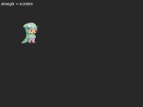
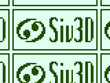
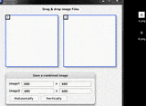
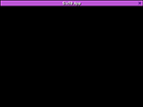

# Siv3D Examples

ここでは、[Siv3D](http://play-siv3d.hateblo.jp/) のいろいろな便利な機能を試したり、紹介したりするために作成した、ちょっとしたプログラムをサンプル集として公開しています。

## サンプル集

|イメージ|リンク|内容|キーワード|
|:------:|:--|:--|:--|
||[s3dkun_blink.cpp](https://gist.github.com/voidproc/14ed210f8067d22c8f3d3ceaf423ea36)|ピクセルシェーダでテクスチャを白く点滅させるエフェクト|PixelShader, ConstantBuffer|
|noimage|[nodraw_during_resize.cpp](https://gist.github.com/voidproc/3139e13be5cbe6627bada396f9db149f)|ウィンドウをのリサイズ中は描画を抑制する|ScalableWindow, StopWatch|
||[decodeimage.cpp](https://gist.github.com/voidproc/21c445757ea33e5d1d2350fd72731fe0)|Base64 でエンコードした画像をソースコードに 直接埋め込み、表示する|Base64|
||[siv3d_scene.cpp](https://gist.github.com/voidproc/721418b49cf5cf1b354c2e0e870ca38b)|ham::SceneManager でお手軽シーンチェンジ|SceneManager|
||[imgcomb.cpp](https://gist.github.com/voidproc/85af87131bfa42b2e369e61284b3da6c)|2つの画像を横または縦に繋げて保存|Image, DragDrop, GUI|
||[siv3d_fade_frames.cpp](https://gist.github.com/voidproc/5a633f1bdef67728e4c35d1c265db709)|描画結果をフレーム毎にフェードアウトさせる効果|RenderTexture|
||[siv3d_custom_titlebar.cpp](https://gist.github.com/voidproc/cbd3ebf226a3cca73d17e9417bac36fc)|タイトルバーと閉じるボタンを独自に実装する|Rectangle|

## 開発環境

* Windows 10 Pro 64bit / Windows 7 Professional 64bit
* Visual Studio 2015 Community
* Siv3D August 2016

## 連絡先

質問や意見などあればこちらへ (Twitter)： [@voidproc](https://twitter.com/voidproc)
